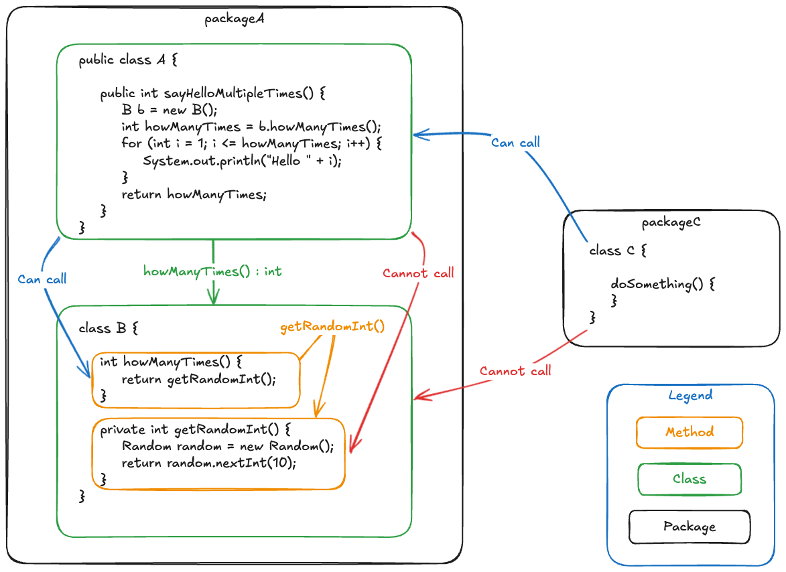
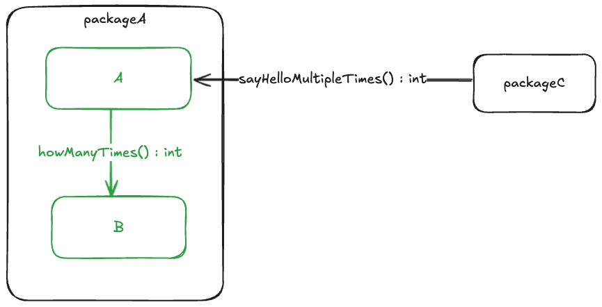

## Introduction

In the [previous post](/posts/design-and-architecture/) I defined Software Design and Architecture, and described Architecture as the structural parts of design.

In this post I want to describe how the architecture of a software system can be graphically represented as simple boxes containing text and arrows between boxes to show a dependency between boxes.

I also want to demonstrate how these graphical representations of our architecture are very useful to understand and reason about a design to determine whether it is a good design or not.

## Why Boxes and Arrows?

Architectural items can be presented as boxes containing textual descriptions of the items. Relationships between architectural items can be represented by arrows from one architectural item to another indicating a dependencies of one item on another. These arrows should also contain text describing the nature of the relationship.

It is important to note that these boxes and arrows exist in our software whether we decide to draw the diagram or not. This is what is meant by the idea of code being self documenting. This idea of self documenting code works well at the lower levels of abstraction, but become harder to spot as the levels of abstraction rises.

The following diagram shows an example of how the nested structure of packages, classes and methods in an object-oriented programming language can be visualised as boxes and arrows.

## Reasoning about design

When reasoning about a design it is not useful to be presented with too many irrelevant details. Thus drawing diagrams like the example above that show too many layers at the same time with all the technical details are not useful for the purpose of reasoning.

It is useful to be able to zoom in and out depending on what you are reasoning about. It is also useful to focus reasoning about a specific architectural item and seeing details of the items directly within and how they relate to other architectural items outside the item being reasoned about.

The following diagram shows the same code as the diagram above, but zoomed out to hide method level details and focusing on `packageA`.

Observations about the above diagram:

- The diagram is focuses on understanding the design of `packageA`.
- All the classes within `packageA` are shown.
- All the dependencies between these classes are show, with details of the method names, input parameters and output types.
- No method level details of the classes inside `packageA` are shown.
- Other packages dependent on `packageA` are shown.
- No details of the classes inside the dependent packages are shown.
- It is clear which classes and methods the dependent packages depends on.
- It is clear which classes inside `packageA` are part of the internal implementation details of the package and can be changed without breaking a contract with the outside world.

## Documenting architectural designs

When documenting architectural designs, it is important to zoom in on a specific architectural item being described as per the example diagram above.

This focus on a specific architectural item will avoid discussions about internal implementation details that will dilute the value of the discussion and avoid discussions about the internal design of dependent architectural items.

## Conclusion

This post showed how architectural design can be represented or documented as boxes and arrows. It also showed how diagrams can be made to be more focused by focussing on a specific architectural item, its immediate descendants and their relationships to architectural items outside of the item under discussion.

The next post will discuss the concepts of coupling and cohesion.