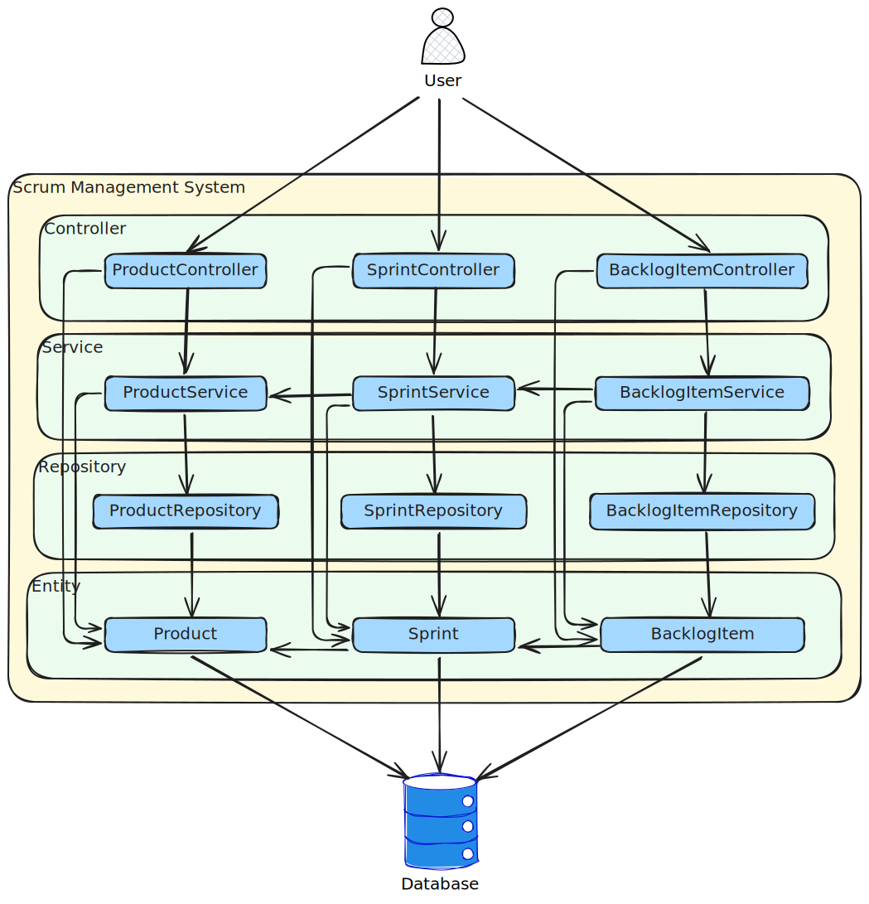
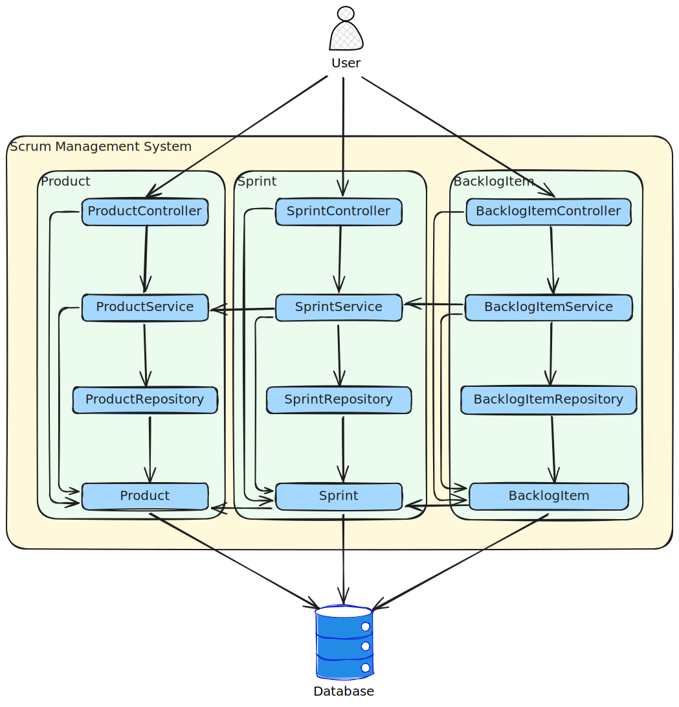

## Introduction

When organizing code for large and complex software systems the concepts of coupling and cohesion often get mentioned. When talking about distributed software architectures such as microservices, these concepts become even more important.

But what exactly are coupling and cohesion? Why are they important?

This blog post will attempt to answer those questions and provide you with some techniques that you may use to evaluate the architecture i.e. code organization of your own software projects.

## It's about organizing code

Image you are developing a large complex software system with 100K+ lines of code and you have all the code in a single file. If you want to make a change to the code, it will be very hard to find the correct lines of code to change in such a large file.

Firstly you could make use of your programming language's ability to make code references across files and plit the single file into multiple files. For example from **my_application** to **my_application_1**, **my_application_2** etc. This won't improve matters much as you would need to know which file to open. So, you would need to give files more descriptive names to give you a good idea what code they may contain.

But now if you have a lot of files, each with a small number of lines of code, you run into the same problem. Which file should I open? The solution to this issue would be to split the files into folders with descriptive names so you know which folder in the list is likely to contain the file you are looking for.

This should all be quite obvious to anyone who has ever needed to organise a large number of files on a computer or on paper for that matter.

The important thing to realize here is that files that are related should be in the same folder. This is what we call **cohesion**.

We would also want to limit the relationships between files in different folders. These relationships would be called **coupling**. Coupling is sometimes unavoidable when you simply have too many related files to keep in a single folder. You do want to split the files into different folders in a logical way to limit coupling.

## Real world example

Imagine you are an accountant that does the accounting for a number of small businesses, say 10. You will likely collect and safekeep many documents of various types, such as invoices (incoming and outgoing), credit notes, proof of payments, bank statements etc. How would you organise these documents?

One idea would be to put all invoices in one folder, all credit notes in another etc. But this sounds like a bad idea if you are looking for a document for a specific client. The best idea would be to have folders for each client so that all the documents for a client are together in one cohesive place.

But you are still likely to have too many documents for one client in a folder. So, you could create sub folders for every type of document.

Even then, you could end up with too many documents in a single folder, so maybe an idea would be to have a subfolder under the client for the financial year, with subfolders for the month and then only the folders for the type of documents.

There would for example be a line on a bank statement that refers to an invoice payment, but this line would refer to an invoice within the same month or the previous months. Thus a reference to a folder that is closeby in the folder structure. This is an example why coupling is sometime unavoidable, but that we should attempt to organise our files in such a way that the coupling is limited to a certain scope. Not too many folders up and down the hierarchy.

## Coupling

Coupling refers to dependencies i.e. code references between files in different folders. Thus if a file in one folder references a file in another folder, the two folders are coupled. Even though coupling is unavoidable, we do want to limit it in some ways. This is why people often say that software modules or microservices should be ligtly coupled, meaning there are not too many dependencies.

Folders in the higher layers of our folder stucture should ideally not be coupled and coupling should be limited to folders deeper down in the folder stucture.

## Cohesion

Cohesion refers to dependencies between files in the same folder and to sub-folders within a containing folder. All the files in a folder should have a dependency relationship with at least one other file in the same folder. If not, why is the file there and does it not belong in another place. This lack of dependencies breaks the cohesion of the folder. The same goes for sub-folders in a folder.

## Two common code structuring approaches

In this section I would like to compare two common code structuring approaches in terms of coupling and cohesion. These two code structuring approaches are **Package by layer** and **Package by function**. For this example I will make use of a Scrum management system as many software developers are familier with Scrum.

### Package by layer

Package by layer refers to the idea that source code can be grouped together based on the technical role they play within our software. Software often has the following technical concerns or layers:

 - **Entities** to decribe the database schema design
 - **Repositories** to manage database access and queries
 - **Services** to manage application business logic
 - **Controllers** to provide a user interface to allow users to control the application from the outside

A top level folder would be created for every architectural layer and all files for that architechtural layer would reside in that folder.

Here we will see that for every database table we have one code file per layer and the dependencies between layers go from **Controller** to **Service** to **Repository** to **Entity**. As the number of database tables grows, the number of dependencies between these packages (folders) grows as well, leading to a very tighly coupled relationship between these layers.

As database tables in a relational database are related to each other in the form of foreign key relationships, it means that our database entity classes in the **Entity** package (folder) have dependencies to one another. This makes this package quite cohesive.

It is generally discouraged to allow one repository to call another repository, so the files in the **Repository** package (folder) tend to be quite uncohesive.

Sometimes the business logic of a file in the **Service** package (folder) relies on data from multiple entities. For example, a Sprint cannot be added to a Product if the product development is complete. Thus the SprintService either needs to use the relationship between the Sprint and the Product to retrieve the product and read its status or it needs to call the ProductService in the same package to retrieve the product status. Depending on your choice the **Service** package may or may not be cohesive.

It is generally discouraged to allow one controller to call another controller, so the files in the **Controller** package (folder) tend to be quite uncohesive.

### Package by function

Package by function refers to the idea that source code can be grouped together based of the functional role they play within our software. Every software system is unique in what functional roles it has, depending on the requirements of that system. Thus every software project's top level folders will be different. This has the disadvantage that looking at the top level folders, a developer will not be familiar with the folders listed. But it has a really big advanatge that looking at the top level folders gives the developer an immediate overview of what the software system is about.

The file names and relationships in this design has not changed and only the way the files were arranged into folders have changed.

Here we will see that every top level package (folder) tends to be very cohesive as it concerns the same business function.

The number of dependencies between top level packages (folders) tends to be fewer and are limited to dependencies between database entities. This leads to a looser coupling between top level packages (folders).

## Enforcing architecture rules

Earlier it was stated that a repository should not call another repository. This is an example or an architecture rule that a team might create. When using a **Package by function** approach, a programming language's visibility features can help us enforce this architecture rule. For example, Java classes have a default visibility of **package private**. If we were to make the ProductRepository package private, the ProductService would be able to call it as they are in the same package, but the SprintService and SprintRepository classes would not be able to call it as they are in a different package.

With a **Package by layer** approach, the ProductRepository would have to be made **public** so that the ProductService can call it from a different package. But making it public means that any class can call it, including the SprintService and SprintRepository.

It should be added that if you create sub-packages in a **Package by function** approach, you will run into the same problem, but there are tools such as [Spring Modulith](https://spring.io/projects/spring-modulith) that can overcome this issue. Therefore Spring Modulith and Spring Boot [suggests](https://docs.spring.io/spring-boot/reference/using/structuring-your-code.html) a **Package by function** approach as a best practise.

## Architectural View

When attempting to document the architecture of the application as a [C4 model](https://c4model.com/) we will find that the packages in the **Package by function** approach is a close match to the 3rd C, namely a [Component](https://c4model.com/abstractions/component). Such a diagram explains valuable knowledge about the business domain and the solution.

In contrast, the **Package by layer** packages cut accross multiple functional areas. You would have components like Controller, Service, Repository and Entity which explains general development concepts that developers already know, but are of little help to explain the business domain of the system.

## Microservices

Microservices fit well with the 2nd C of the C4 model, nameley a [Container](https://c4model.com/abstractions/container). A container refers to a separately deployable part of an application.

If you start out with a well structured monolith with clearly defines modules in the form of **Package by function** packages. You can then document these packages as a C4 model component diagram to understand the dependencies between the packages. Groups of packages which are more tightly couples can then be split out into a microservices. The C4 model would also be updated to refelct that these components have been moved to a different container. This may avoid the pitfall of prematurely picking microservice boundaries before the dependencies are properly understood.

## Conclusion

Coupling and Cohesion are important concepts to understand. Keeping these concepts in mind when reasoning about your software architecture choices can be a valuable tool to arrive at a better software architecture.