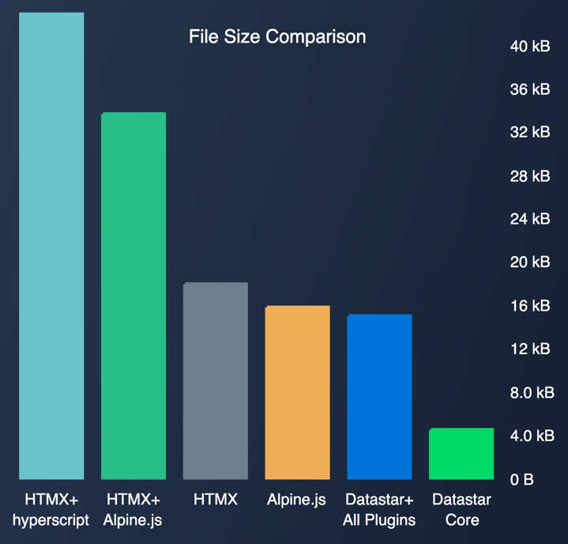

## Introduction

With the v1.0.0 release of [Datastar](https://data-star.dev/), I decided to write a review of this new technology that I have been experimenting with over the last few months.

## What is Datastar?

Datastar is a [hypermedia framework](https://htmx.org/essays/hypermedia-driven-applications/) that helps you build reactive web applications with the simplicity of server-side rendering and the power of a full-stack SPA framework.

The name Datastar (or D*) is derived from the [HTML data-* Attribute](https://www.w3schools.com/tags/att_data-.asp). The HTML data-* attribute is used to store custom data private to the page or application. These data-* attributes are valid HTML and the authors of Datastar wanted it to be HTML spec compliant. Maybe Datastar's use of these attributes does not match the original intent of storing custom data, but I don't think we need to nitpick about such small details.

Datastar enhances the power of HTML by using data-* attributes to declaratively add front-end and back-end reactivity to HTML pages of a Multiple-page Application (MPA).

## History of Datastar

Datastar is a spiritual successor to [HTMX](https://htmx.org/). The creator of Datastar, Delaney Gillilan was a contributor to HTMX and part of the HTMX open source community. HTMX is a Javascript library written as a single Javascript file without a build step. Delaney had the idea to rewrite HTMX using Typescript with a build step, which would make it easier to debug and fix some concerns that he had with HTMX.

During this rewrite process his ideas about how a Hypermedia framework should work started to evolve and Datastar was born.

## The HTMX approach to hypermedia

Let us look at the simple [Click To Edit](https://htmx.org/examples/click-to-edit/) HTMX demo from the HTMX Examples web page.

```html
<div hx-target="this" hx-swap="outerHTML">
    <div><label>First Name</label>: Joe</div>
    <div><label>Last Name</label>: Blow</div>
    <div><label>Email</label>: joe@blow.com</div>
    <button hx-get="/contact/1/edit" class="btn primary">
    Click To Edit
    </button>
</div>
```

The HTMX attributes do the following:
- The `hx-get="/contact/1/edit"` attribute on the button element tells HTMX to do an HTTP Get request to the specified URL when the button is clicked.
- The attribute `hx-target="this"` is inherited by the button element and tells HTMX to target the div tag with this attribute for the update.
- The `hx-swap="outerHTML"` is also inherited by the button element and tells HTMX to swap the outer HTML of the targeted element with the HTML retrieved by the HTTP Get request.

This is a very powerful idea to do partial HTML page updates to create a more responsive experience for users.

I do however have a small concern with the HTMX approach. The **hx-get** is used to initiate an HTTP request, but the **hx-target** and **hx-swap** attributes are used to process the response of the HTTP request. This distinction puts HTMX attributes in one of 2 categories:

- Used for the HTTP request
- Used for the HTTP response

This distinction requires the server to decide how to update the DOM with the HTTP response when the original HTML with the **hx-get** is rendered and not at the time when the actual HTTP request of the **hx-get** is processed.

Imagine a requirement where a different HTML element should be targeted or a different swap option being required for the swap depending on the state of the server at the time of the **hx-get**. Which one of the options to use on the original HTML gets a bit tricky.

HTMX has [various strategies](https://htmx.org/examples/update-other-content/) such as _out of band swaps_ that can be used for these more complex scenarios. This does add complexity to HTMX and make the learning curve steeper, but for most applications these complex strategies are not required.

## The Datastar approach to hypermedia

Datastar has taken the decision to use [Server Sent Events (SSE)](https://en.wikipedia.org/wiki/Server-sent_events) for hypermedia HTTP requests. This approach is very powerful and allows for a single mechanism that can do everything HTMX can do, and more.

Unfortunately most developers are not familiar with Server Sent Events and this discourages some developers from trying Datastar. This was what caused my initial hesitation. I have also shared Datastar with other developers who had the same initial reaction and asked valid questions about security etc. I am happy to report that Server Sent Events are nothing to be scared of as they are just like any other HTTP request and they use the media type `text/event-stream` instead of the usual `text/html` or `application/json`.

Once I started experimenting with Datastar my concerns quickly evaporated and were replaced by the excitement of being able to do amazing things with very simple code.

Below is the same [Click To Edit](https://data-star.dev/examples/click_to_edit) example from HTMX, but in Datastar. I removed the reset button from the linked example to to make the HTMX and Datastar versions easier to compare.

```html
<div id="contact_1">
  <label>First Name: John</label>
  <label>Last Name: Doe</label>
  <label>Email: joe@blow.com</label>
  <div>
    <button data-on-click="@get('/examples/click_to_edit/contact/1/edit')">
      Edit
    </button>
  </div>
</div>
```

Only a single Datastar attribute `data-on-click="@get('/examples/click_to_edit/contact/1/edit')"` is required to initiate the hypermedia HTTP request.

The `id="contact_1"` attribute of the outer div element is also important. In the [Datastar Server Sent Events](https://data-star.dev/reference/sse_events), the server will send a **datastar-merge-fragments** event with the HTML fragment to be merged. This merge fragment's root element will also have the same `id="contact_1"` attribute to tell Datastar which HTML element to merge in the DOM.

The server can send zero, one or more Datastar Server Sent Events to merge HTML fragments into the DOM or remove HTML fragments from the DOM.

Datastar merges HTML fragments using a strategy inspired by a library called [Idiomorph](https://github.com/bigskysoftware/idiomorph) instead of replacing DOM elements. This has the advantage of preserving the state of DOM elements in the browser and results in a better user experience. Audio or video playing in the merged fragment will not restart and the values of input fields will not be reset. These small quality of life experience make a real difference to the user experience and is an important differentiator between an MPA and an SPA, if the SPA developer chooses to implement it.

## Late addition to Datastar

Shortly before the v1.0.0 release, a decision was taken to allow the Datastar client library to also receive `text/html`, `application/json` and `text/javascript` as an alternative to the merge fragments, merge signals and execute scripts SSE events.

I believe this was a great decision to lower the barrier of entry to using Datastar and provides an alternative to SSE events. If only the screen of the user who initiated the action needs to be updated, then this new feature should be sufficient. But if you want to tap into the full potential of Datastar multi-player applications, where multiple user screens are updated in real time, then SSE events are still the way to do it.

## Client side reactivity

When developing reactive web applications, you will quickly find yourself needing some client side reactivity. This could be anything from disabling a button, showing a spinner or updating an icon when a user interacts with a web page. This interaction sometimes involves making a hypermedia request, but not always.

This requirement is outside the scope of HTMX, but the official HTMX documentation does propose [some solutions](https://htmx.org/docs/#scripting) for the requirement. These proposed solutions are:

- VanillaJS
- AlpineJS
- jQuery
- hyperscript

I have not found any of the above solutions very appealing, but Datastar supports the requirement of client side reactivity natively with the use of signals.

## Datastar is small

Datastar is currently 14.5 KiB, which is smaller than HTMX and AlpineJS while providing equivalent functionality than the pair combined.



## Server Side SDKs

Datastar has a number of official [SDKs](https://data-star.dev/reference/sdks) that are available to help you get up and running even faster, and help with the development of [Server Sent Events](https://data-star.dev/reference/sse_events).

When experimenting with Datastar, I quickly learned that SSE was nothing to be afraid of and these SDKs make the simple task of generating the SSEs even simpler. Even so, my major concern with Datastar is with the SDKs.

As a Java / Spring Boot developer, the Spring Framework already supports SSEs is the form of the classes **SseEmitter** for Spring MVC and **ServerSentEvent** for Spring Webflux (reactive). These classes provide a level of abstraction on top of the underlying HttpServletResponse. These abstractions are generally used in the Spring Controller classes. The Datastar official Java SDK uses the underlying request and  response objects, which I did not like.

When implementing more complex SSE functionality where events are emitted to multiple connected clients, **SseEmitter** instances can be stores in a data structure like a map or a set to store a reference to the HTTP connection on which the SSE events are to be emitted. 

What I found with the official Java SDK as well as most of the SDKs for other languages was that the HTML for the merge fragment events is build with string concatenation/replacement and thus mixing Java and HTML code. Here is an example from the Java SDK:

```java
MergeFragments event = MergeFragments.builder()
    .selector("#feed")
    .mergeMode(FragmentMergeMode.Append)
    .useViewTransition(true)
    .data("<div id=\"feed\">\n<span>1</span>\n</div>")
    .build();
```

I would prefer to have a clear separation of concerns between the View (HTML) and the Controller in MVC and with Spring MVC we already have a choice of view template engines such as [JTE](https://jte.gg/) and [Thymeleaf](https://www.thymeleaf.org/). These template engines also protect against security concerns such as [Cross Site Scripting (XSS)](https://owasp.org/www-community/attacks/xss/), which I would have to be responsible for if using string concatenation/replacement.

Spring MVC does not make it easy to get hold of the HTML rendered by the template engine as the template engine only gets called after the Controller code has completed. See for example:

```java
@GetMapping("/greeting")
public String greeting(
        @RequestParam(name="name", required=false, defaultValue="World") String name,
        Model model) {
    model.addAttribute("name", name);
    return "greeting";
}
```

In the above example, the **name** attribute is injected into the model by the controller code. The method return value **"greeting"** is the name if the template used to render the HTTP response.

## My Datastar SDK

With the above concerns in mind I ended up developing my own SDK specifically for using Datastar with Spring MVC and [JTE](https://jte.gg/).

The [jte-datastar-spring-boot-starter](https://github.com/Gadnex/jte-datastar-spring-boot-starter) is published on Maven Central. It makes it very easy to use a Spring SseEmitter in your controller and generate the HTML for the SSE using JTE.

```java
private static final ExecutorService EXECUTOR = Executors.newVirtualThreadPerTaskExecutor();

@Autowired
private Datastar datastar;

@GetMapping("do-something")
public SseEmitter doSomething() {
    SseEmitter sseEmitter = new SseEmitter();
    EXECUTOR.execute(
            () -> {
                // Perform business logic here
                var something = "Business logic result";
                datastar.mergeFragments(sseEmitter)
                        .template("TemplateName")
                        .attribute("something", something)
                        .emit();
                sseEmitter.complete();
            });
    return sseEmitter;
}
```

SSE events need to be emitted on a separate thread, so that the SseEmitter can be returned to the client browser immediately where Datastar can start listening for SSE events.

## Use Datastar sparingly

If you choose to develop an application using Datastar, I would suggest using hypermedia requests sparingly. Most of the time a standard MPA with a full page refresh is what you need. Browsers have gotten much better in recent years and with features like [cross-document view transitions](https://developer.chrome.com/docs/web-platform/view-transitions/cross-document) you can get most of the SPA responsive feel in an MPA.

Follow the advice of the Datastar guide and [Stop Overcomplicating It](https://data-star.dev/guide/stop_overcomplicating_it).

## Save time and money

In my opinion more teams should consider developing a [Hypermedia-Driven Application](https://htmx.org/essays/hypermedia-driven-applications/) before reaching for a more complex tech stack with a Javascript SPA framework and a back-end JSON API or ["RESTless"](https://htmx.org/essays/how-did-rest-come-to-mean-the-opposite-of-rest/) API.

I find developing MPA applications with a server side template engine to be a simpler, faster and more enjoyable experience than most Javascript frameworks and JSON API's.

Even if you feel that Javascript frameworks are fast and enjoyable to develop with, you still need to admit that with a Hypermedia Driven Application you do not need to develop a JSON API for the back-end and a JSON API client for the front-end. This will certainly save you some time, money and complexity.

Some experts have also been warning that Javascript frameworks have [not been delivering](https://infrequently.org/2024/11/if-not-react-then-what/) on their promise.

## Conclusion

HTMX is a good place to start when you need to dip your toes into Hypermedia-Driven Applications, but I believe Datastar provides a better overall experience. 

I have really enjoyed the time I spent experimenting with Datastar. Thank you Datastar team. 