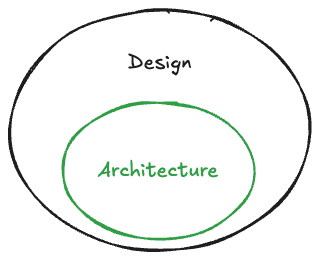

## Introduction

The goal of this post is to explain at a very high level what Software Design and Architecture is. It will also attempt to explain the difference between the two concepts.

Lastly it will also touch the topic of documentation and how it relates to design and architecture. 

## What is Software Design?

> Software design is the process of conceptualizing how a software system will work before it is implemented or modified. Software design also refers to the direct result of the design process – the concepts of how the software will work which consists of both design documentation and undocumented concepts.
> 
> <cite>-- [Wikipedia](https://en.wikipedia.org/wiki/Software_design)</cite>

Whenever we as software developers are thinking about how our code will work, how it is organised or how the resulting software will look and behave, we are in fact busy with design. Design is not confined to the things we decide to document.

## What is Software Architecture?

> Software architecture is the set of structures needed to reason about a software system and the discipline of creating such structures and systems. Each structure comprises software elements, relations among them, and properties of both elements and relations.
>
> ...
> 
> Software architecture is about making fundamental structural choices that are costly to change once implemented.
> <cite>-- [Wikipedia](https://en.wikipedia.org/wiki/Software_architecture)</cite>

This definition of Software Architecture places a focus on the structural definition of software which has software elements and relations among them, with a clear definition of the properties of both the elements and the relations.

I would add to this that these structures are not flat, but that you in fact have structures within structures in a nested hierarchy.

## What is the difference between Design and Architecture?

[Grady Booch](https://en.wikipedia.org/wiki/Grady_Booch) says “all architecture is design but not all design is architecture”. This idea would lead to the following venn diagram:

I very much agree with this idea. If I for example design a user interface screen for a web application, then I am definitely busy with design, but I am not busy with architecture. This design would not have anything to do with the structure of the system, nor should it be costly to change.

On the other hand, if I am busy deciding on whether to build this web screen as a server side rendered multiple-page application (MPA) or a client side rendered single-page application (SPA), then I am definitely busy with architecture. This is true because this decision would affect the structure of the application and would be costly to change at a later stage.

## Which aspects of design should be documented?

I will argue that we should not attempt to document all aspects of design, and we should definitely not engage in big upfront design. Our documents should mostly consist of diagrams, with paragraphs of text used sparingly where needed. 

I believe that the parts of design worth documenting is the architecture parts. This is because these documents / diagrams help us understand the current architecture and reason about it. This reasoning can help us make changes to the architecture or just solve coding issues with a better understanding of the architecture. The architecture is also the parts that are most costly to change, so understanding and communicating it well is important.

We want to delay our architectural decisions as long as possible so that we can gather as much data/knowledge as possible before making the decision.

## Conclusion

In this post we have looked into the basic definitions of design and architecture and discussed some important grounding concepts about architecture and documentation thereof.

In my next post I want to dive a bit deeper into how the structural nature of architecture should be documented.