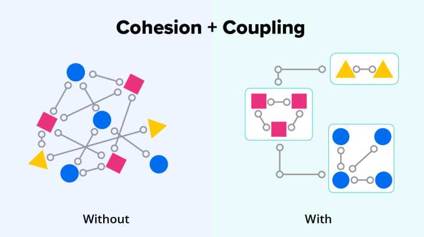
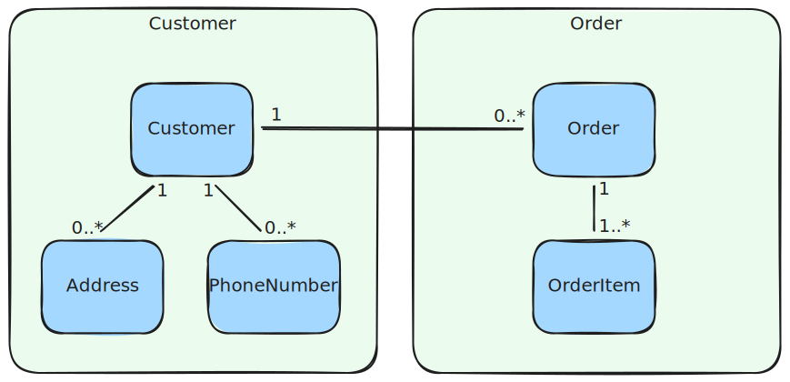
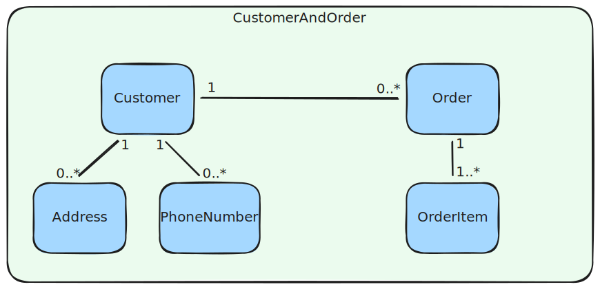
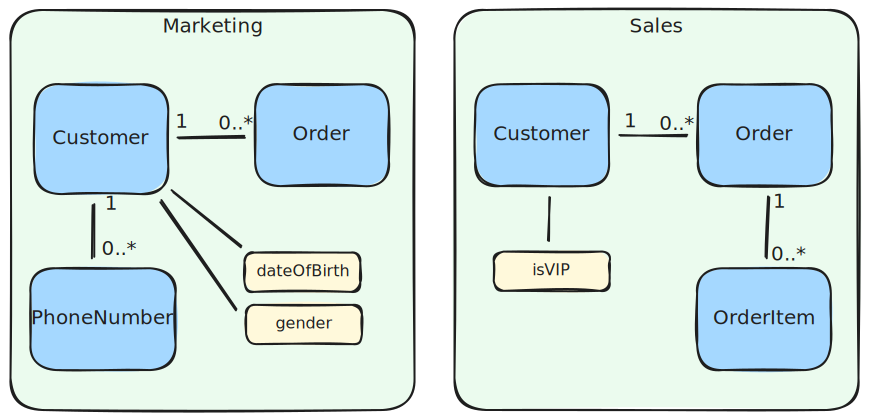
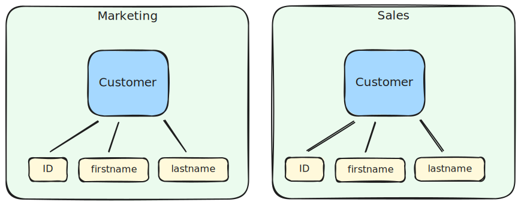
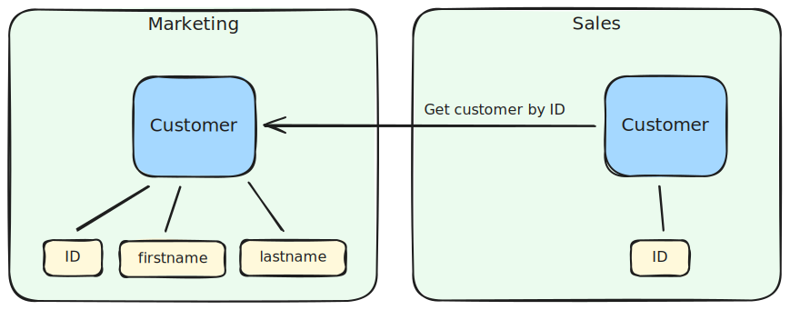
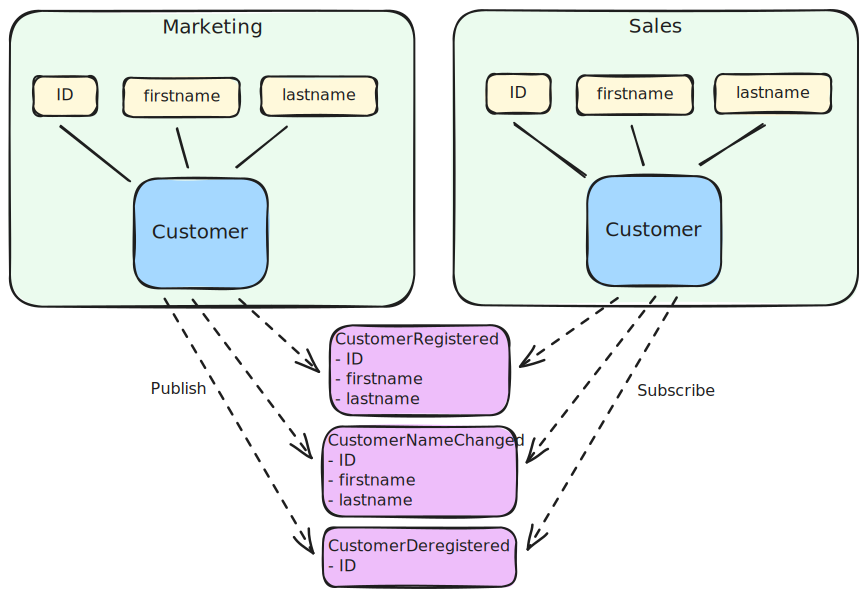
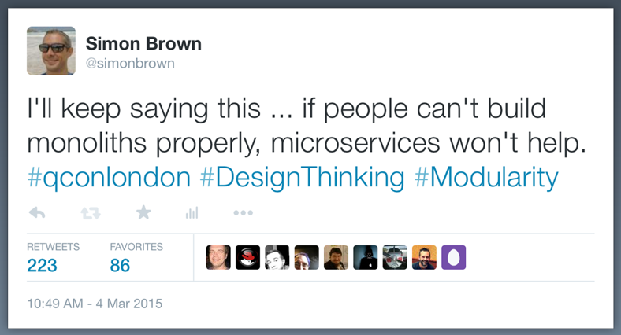

## Introduction

This post presents some ideas about how to break up a large and complex software system into modules that are lightly coupled and hightly cohesive. 

## The "Big Ball of Mud"

Developing small simple systems is easy. As systems grow and get more complex, the number of dependencies grow. It gradually gets harder to learn and remember all the dependencies.

Eventually the complexity gets out of hand. When you make changes in one part of the system a another part of the system breaks. You didn't even realize that the two parts of the system had a dependency.

This phenomenon is often referred to as a "Big Ball of Mud". 

## The solution

The solution to the big ball of mud is to devide the system into pieces referred to as modules.

Each module should be highly **cohesive**, meaning that all the code in the module should be closely related.

The modules should also be **lightly coupled**, meaning that there are as few as possible dependencies between the modules.

The combination of these two goals should create a situation where changes in one module is less likely to break something in another module.

Refer to the [Coupling and Cohesion post](/posts/coupling-and-cohesion/) for more information. For the rest of this post we will assume a modularization strategy where modules are defined by their functional behaviour and not their technical responsibility.

## Tight coupling

We will look at an example of an online shopping system with customers and orders. Initially we create a customer module containing the customer entity and an order module containing the order entity. There is a one to many relationship between the customer and order entities.

The customer and order modules are coupled in a number of ways:
  - When a new order is created, we need to ensure that the customer for the order is a valid customer.
  - When an order is retrieved and displayed, we also need to retrieve details about the customer of the order.
  - If we want to determine if a customer is a VIP customer, then we need to retrieve data about the number and value of the customer's orders.

With every new feature we build in our system, we tend to increase the coupling between modules. We are starting to build a ball of mud.

## Combining modules

Maybe customer and order are not separate modules after all and should be combined in a single module.

The problem with this solution is that the same thing will happen with all the modules of our system, leading to one single big module. This is exactly where we started.

Is there perhaps some "out of the box" thinking we can do to devide modules in a different way?

## Splitting entities

What if we do **not** split our modules between the major entities in our system, but rather making the split in the middle of our major entities. This would mean that the same entity would occur in multiple modules.

The entity in different modules would always have the same ID, making it clear that it is the same real world thing. All the other entity fields would occur only in one module, which is the module that owns and needs the field. It is important to stress that the **entities look different in every module** and they are not copies of the same data.

This idea is very unintuitive, but it does result in modules that are more lightly coupled. The modules are still coupled by the shared IDs that appear in different modules, but this coupling is lighter. One module does not need to call another module that get data required for its business logic.

This idea is also described in Domain-Driven Design (DDD) where each domain (aka module) has its own ubiquitous language. The same word may have different meanings withing different domain boundaries.

The name of the entity could be different between modules depending on the context of the module. This could actually be an advantage allowing better and more specific names.

## Fields required in multiple modules

We have already discusses why the ID field of the entity is duplicated in every module where the concept occurs.

What do we do if we find some other entity fields, for example the firstname and lastname of the customer that really are required by multiple modules?

## Inter module service calls

One module can be declared the owner of the shared fields. It would be the only module that can change these field values. Other modules can only use the field values. Other modules can make inter module service calls to the owning module to retrieve the field values.

These inter module service calls are coupling our modules together. More specifically, this is a form of **synchronous and temporal coupling**. If these inter module service calls occur over a network connection it also leads to other problems:
  - If the owner module is broken, the calling module will also break.
  - If the owner module is slow, the calling module will also become slow.
  - You need to deal with other technical issues such as network latency, security etc.

An advantage here is that the inter module service calls are only for the shared fields and not all the fields of the entity. This makes the interfaces (contracts) of these inter module service calls more stable as they do not share all the data of the owning module.  

It is a good idea to properly document these dependencies so that they are made visible.

## Inter module events

Another option is to duplicate the fields in multiple modules. One module is still declared the owner of the shared fields. Whenever the values of the duplicated fields are changed by the owning module, it will publish an event with the new values and the reason for the change. Other interested modules can then subscibe to these events and create or update their own copy of the duplicated fields.

Using events instead of inter module service calls is still coupling, but it is a ligher form of coupling. It is not synchronous and temporal coupling, but rather **asynchronous coupling**.

Duplicating fields do have the drawback of increased storage costs. Events can be technically more complex to implement than inter module service calls. They may require infrastructure such as message brokers or libraries.

## Eventual consistency

An important point to remember is that events do not neccesarily get processed by subscribers immediately. They may take some time to sync the field values. During this time the subscribing modules will have outdated data. That is what it means to be **eventually consistent**.

This eventual consistency should be a deliberate design choice that is accepted by the business stakeholders.

Events do make it possible to deploy modules independently as there is no synchronous or temporal coupling. Events also tend to be more stable in their structure (contracts) than traditional inter module service call interfaces.

It is a good idea to properly document these events to make them visible.

## Monoliths and Microservices

Software modularisation is applicable to both monolithic and microservice architectures. It is a design choice how software modules are deplayed as a monolith or as separate microservices.

The advice for building monoliths has always been that they should be properly modularized. The new and popular architecture terms are **Modular Monolith** or **Modulith**, but it basically just means a well modularized monolith.

Inter microservice events require an external message broker, but with monoliths message brokers are optional.

[Good advice](https://www.youtube.com/watch?v=S8Aiqws3N5o) for building microservices is to start by building a well modularized monolith. Your initial instincts about module boundaries will most likely be wrong. Experimenting and changing module boundaries in a monolith is much simpler than with microservices. When you are more confident in your module boundaries and clearly understand the dependencies, it is possible to extrack modules into their own microservices.

## Conclusion

Our intuitions about how to devide a software system into modules is sometimes wrong. Drawing module boundaries by splitting entities is unintuitive, but can lead to modules that are more loosely coupled.

Using inter module events instead of inter module serice calls can change their coupling to be asyncronous and eventually consistent. This allows for modules to be separately deployable and good candidartes for microseervices.    