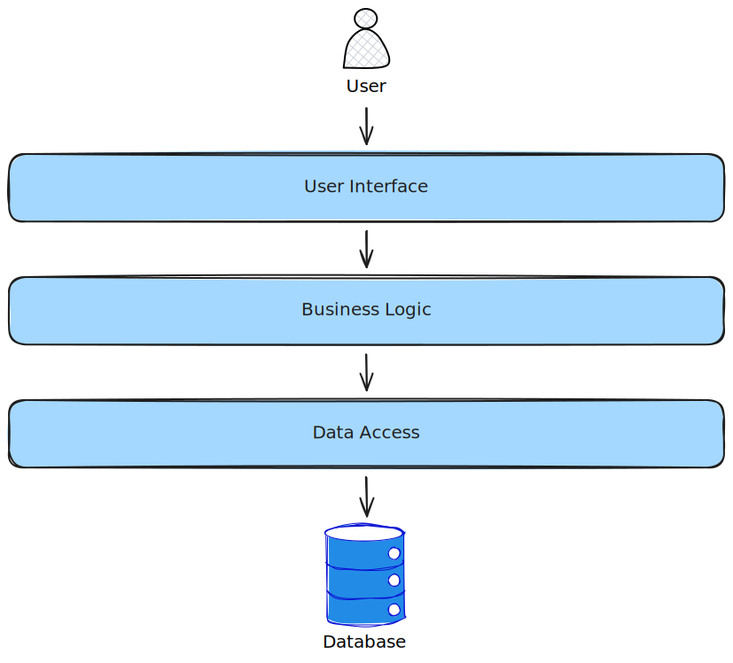
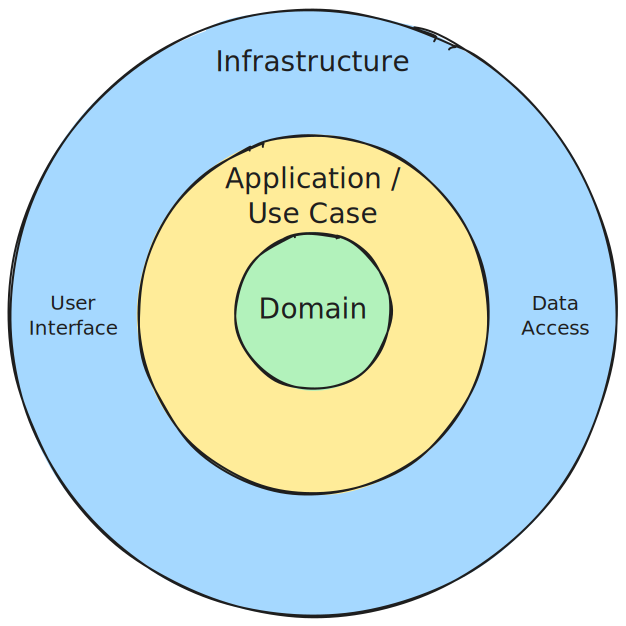

## Introduction

Eric Evans's book Domain-Driven Design was first published in 2003 and [Domain-Driven Design](https://en.wikipedia.org/wiki/Domain-driven_design) (DDD) has become very popular in the last 20+ years.

DDD focuses on modeling software to match a domain and to create the domain model using the language of that domain.

I have often found users and proponents of DDD not using the domain to "drive" the design, but only seeing the domain as an important component of the design. They prefer to let something else "drive" the design.

In this post I would like to make the argument that in the context of DDD, it is the domain that should be driving the design.

## What does driving a design mean

For something to drive a design, it should come first and its result will be the input or the driver of the rest of the design.

So, for DDD the domain should be created or designed first and the design of the rest of the system should be driven by the design of the domain.

## Layered Architectures

Before the time of DDD, layered architectures were the only game in town. They still remain popular today and are an appropriate choice in many scenarios.

Layered architectures were often described as N-tier architectures where the **N** was a variable that could be replaced by a number representing the exact number of layers in your architeture. 3-tier architectures are very common.

### Top-down design

Some developers believe the best place to start the design is at the user interface. After the user interface design is done, you work your way down the layers to design the rest of the system.

With this approach the user interface design drives the rest of the design.

One popular example of top-down design is Rapid Application Development (RAD). It was developed in the 1980's at IBM and first published in a 1991 book. RAD was an early response to waterfall. You would start with propotype screens and work iteratively to build the system.

### Bottom-up design

Some developers believe the best place to start the design is with the database schema. After the database schema design is done, you work your way up the layers to design the rest of the system.

With this approach the database schema design drives the rest of the design.

This approach goes by many names, i.e. Database First, Bottom-Up Design and Data-Driven Development/Design.

In order to design a database schema, one does require a wide and in depth understanding of the system requirements.

## Domain-Driven Design

In contrast to top-down design and bottom-up design, DDD starts with the behaviour of the system. The logic that is typically found in the Business Logic layer of the 3-tier architecture.

With this approach you would start with the middle Business Logic layer of the 3-tier architecture and work your way both up and down. When looking at a diagram of a 3-tier architecture, this approach makes little sense. Therefore a different diagram is required.

This diagram makes use of concentric circles instead of layers. The domain appears at the centre of the architecture. It is the place where you start with the design and that drives the rest of the design. In other words, the design starts in the centre and works outwards.

### Domain Layer

The Domain Layer contains the domain model. The domain model is a rich model that focuses on behaviours, not just on data and relationships. These rich behaviours differentiates the domain model from the database schemas of Bottom-Up Design approaches.

The domain model is written in the language of the business and is technology agnostic. The Domain Layer has no outgoing dependencies.

### Application / Use Case Layer

The Application / Use Case Layer is the middle layer that exposes the behaviours of the Domain Layer as Use Cases or features. This layer is dependent on the Domain Layer.

This layer does not typically contain any business logic, but rather focuses on orchestration logic. This layer is fairly technology arnostic, but may be responsible for technical concepts like transactions and security.

### Infrastructure Layer

The Infrastructure Layer is the outer layer where the technology resides. This layer is dependent on the Application / Use Case Layer and the Domain Layer.

There are usually 2 types of infrastucture, namely incoming and outgoing. Examples of incoming infrastructure are user interfaces, APIs and message consumers. Examples of outgoing infrastructure are databases, message producers and outgoing API calls.

## Different interpretations of DDD

As stated in the introduction, some developers interpret DDD differently. While they do see the DDD layers as a way to structure code and to seperate the domain from the technical concerns, they do not start the design at the domain. The domain does not drive their design.

Approaches of starting with the design of a database schema are common. The monolithic database schema is then split into modules or microservices that own that part of the database schema. These designs tend to result in modules or microservices that are tightly coupled in the places where the database schema relationships cross module boundaries. This is because the modules were created by looking at data and relationships and not behaviours.

Other approaches that start with screen designs or JSON API designs are equally common. JSON API designs in particular tend to become CRUD (Create, Read, Update, Delete) based, moving the real behaviour or business logic to the user interface or the mind ot the user. The domain models thus become anemic and being just representations of data and relationships, without any clear expression of the behaviour.

DDD where you start with the domain and thus the behaviour leads to rich domain models. The designs in the infrastructure layer, i.e. database schemas and JSON APIs, may end up looking very different to the designs one would come up with if you started there.

## Conclusion

DDD is more than just a way to structure code in a way that creates a separation of concerns between business and technical concerns.

DDD is a design approach there you start with the design of rich domain models that focus on behaviours rather than data and relationships. By starting at the domain, you may end up with designs that have more independent modules that are easier to develop and maintain. 