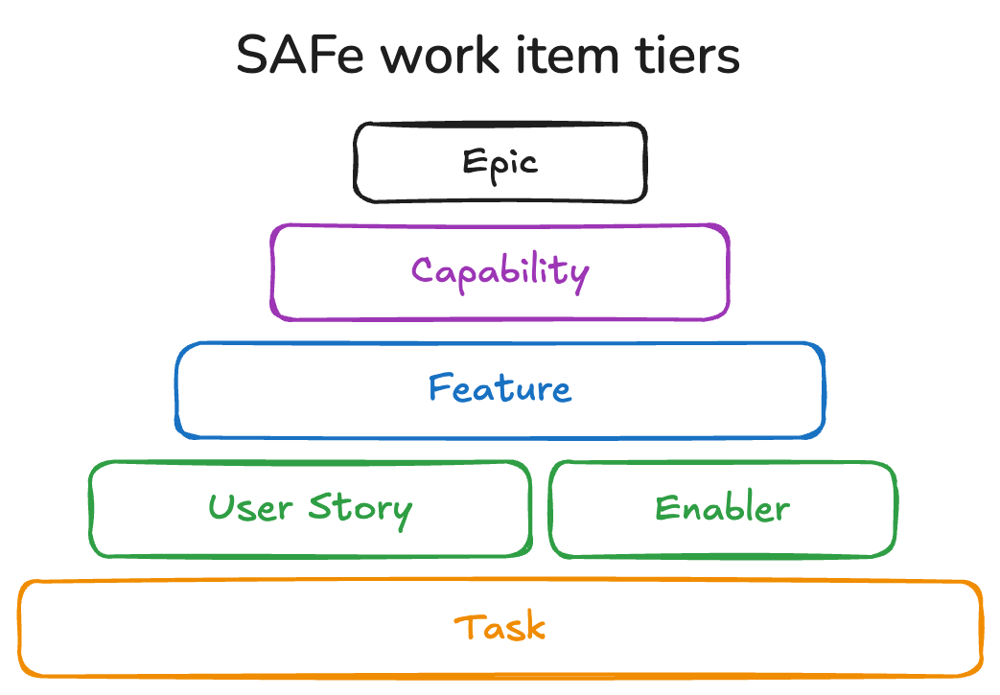

## Introduction

I have noticed that the definition of the term User Story has drifted to become something quite different from the original intent.

This gradual drifting of the definitions of terms is a common occurrence in IT, as can be seen from [this article about REST](https://htmx.org/essays/how-did-rest-come-to-mean-the-opposite-of-rest/).

In this blog post I will explain why this change is important and has a real impact on how teams work.

## Original definition of a User Story

In 1997, Kent Beck introduced user stories at the Chrysler C3 project in Detroit.

Below are some definitions of the term user story that closely matches Kent Beck's original intent.

> In software development and product management, a user story is an informal, natural language description of features of a software system. They are written from the perspective of an end user or user of a system, and may be recorded on index cards, Post-it notes, or digitally in specific management software.
> <cite>-- [Wikipedia](https://en.wikipedia.org/wiki/User_story)</cite>

> A user story is an informal, general explanation of a software feature written from the perspective of the end user. Its purpose is to articulate how a software feature will provide value to the customer.
> <cite>-- [atlassian.com](https://www.atlassian.com/agile/project-management/user-stories)</cite>

> A user story is a short, simple description of a feature told from the perspective of the person who desires the new capability, usually a user or customer of the system. 
> <cite>-- [Mountain Goat Software](https://www.mountaingoatsoftware.com/agile/user-stories)</cite>

User stories are often written in the following form.

<div class="handwriting">
As a < type of user >, I want < some goal > so that < some reason >.
</div>

In my opinion, user stories sit firmly in the requirements space of software development. They describe *what* the system should do, for *who* and *why* it is required. Thus the *who*, the *what* and the *why*.

User stories are **NOT** tasks that development team members will perform.

It is often stated that a user story is a placeholder for a future conversation. This future conversation is where the real value of user stories are.

It is logical to make user stories part of your plan, so that you can plan when the future conversation will take place. When the future conversation takes place, the output of this conversation will likely include a set of tasks that various team members will work on. These tasks can also be made part of the team's detailed plan.

It is however illogical to see a user story as a work item in a plan that is assigned to a single team member to complete. This idea completely misses the point of having the future conversation.

## New definition of a User Story

More recently the definition of a user story has changed significantly in some contexts. Below is a definition of a user story from the Scaled Agile Framework (SAFe).

> A story describes a small piece of functionality that an Agile Team can finish in a few days or less. User stories outline the value to the end user. Enabler stories outline the necessary work of exploration, architecture, infrastructure, and compliance. Each story focuses on a specific behavior that can be developed in incremental steps to offer value to the user or the solution. Keeping stories small ensures they can be completed in a single iteration, allowing every iteration to deliver value.
> <cite>-- [framework.scaledagile.com](https://framework.scaledagile.com/story)</cite>

While the above definition does retain some of the original meaning of a user story, one can see the focus shifting away from the idea of identifying a requirement that will be the topic of a future conversation, and heading towards the idea of a user story being a work item that can be completed in a few days.

The next paragraph states. 

> SAFe describes four tiers of work items that detail functional system behavior: Epic, Capability, Feature, and Story.
> <cite>-- [framework.scaledagile.com](https://framework.scaledagile.com/story)</cite>

Here we see the idea that user stories are just work items in a specific tier in a project work breakdown structure. SAFe theory describes how *epics* are identified high up in an organisation's management structure. These *epics* are then broken down into *capabilities*, which are assigned to different Agile Release Trains (ART). These *capabilities* are then broken down into *features*, which are assigned to different Scrum teams in the ART. These *features* are then broken down into *user stories*, which are placed on the Scrum team's product backlog and delivered over a number of sprints. The Scrum team may internally divide a *user story* into a set of tasks to deliver the user story, but this is outside the scope of what SAFe theory describes.



Personally I find it hard to believe that breaking down a high level epic into capabilities, then features, and then user stories will result user stories from the perspective of the user. One will likely end up with a very technical tasks that a single Scrum team member is expected to complete, with little need for a conversation with anyone other than the most technical members of the team.

The following [blog post at scrum.org](https://www.scrum.org/resources/blog/common-pitfall-user-stories) describes this common pitfall of user stories that do not lead to the valuable discussions.

It is not my desire to criticize SAFe, as I am a SAFe certified architect, but it serves as a good example of the phenomenon. I think this top-down breakdown of high level goals to detailed tasks is very intuitive and multiple people have independently came up with the same idea. We should just be aware that our intuitions can lead us astray and the best ideas are sometimes not intuitive. For example, if we look at the world around us, our intuitions might tell us that the world is flat, but science has discovered that it is not. 

## Examples of good and bad user stories

Below is an example of a user story that I would consider to be a good user story.

```text
As an online shopper 
I want to add a product to my shopping cart
so that I can purchase multiple products in a single order.
```

This user story would require a discussion between stakeholders to find the best solution possible.

Below is an example of a user story that I would consider to be a bad user story.

```text
As a developer 
I want to add a shopping cart item table to the database schema
so that we have a record of the customer's shopping cart contents in our database.
```

This user story would not require discussions like the good story would. Most likely someone else has already identified the requirements, designed a solution and split this solution into pieces of work which are thrown over the wall to the development team. The only discussions required would be internal to the development team to decide what the name of the table should be and what columns it should have. This is an example of big upfront design and programming by remote control. This goes against the grain of agile and turns programmers into nothing more than code monkeys.

I believe that a collaborative design created by developers and users as a team will lead to better overall solutions and a happier and healthier team environment.

If the user stories that I consider bad do work for your team, why not fully embrace your way of working. Why not call them tasks and avoid all the baggage associated with user stories. The above example can then be stated simpler as:

```text
Add the shopping cart item table to the database schema
```

## How to identify good user stories

If a top-down breakdown of high level goals to detailed tasks is not a good way of identifying user stories, then how should we go about it?

We can look to the world of object-oriented programming where the technical detail of data and implementation logic is hidden inside an object. This object is like a black box and only exposes a simple interface that makes interacting with the object simpler as you don't need to care about the internal details.

For user stories we can look at the entire system as a black box and describe the system from the perspective of the user outside the system. The "user" in user story is very important.

I would also advise looking at Use Cases from UML, which are a precursor to user stories. [Alistair Cockburn](https://en.wikipedia.org/wiki/Alistair_Cockburn) wrote a seminal book titled [Writing Effective Use Cases (Agile Software Development Series)](https://www.amazon.com/Writing-Effective-Cases-Software-Development-ebook/dp/B00I077Z1M) in which he describes how to identify and write use cases. Therein he explains the concept of a sea level (user goal level) use case and that all use cases should be written at sea level. This same concept of sea level applies well to user stories and having all user stories at sea level makes them comparable when assigning relative story points to user stories.

I use the following process to identify user stories:

1. I write a short paragraph or two to describe what the system is and is not, so that we can use this to determine whether a user story is within scope. Here a less-is-more approach is important, do not write too much.
2. Next I identify all the users that will interact with the system described in step 1. We do not get it perfect the first time, so do not spend too much time on this. Just get a good enough list together.
3. Next I take the users from step 2 one-by-one and identify all their user stories. Remember user stories are the goals of these users.

I should add that some experience is required to know whether a user story is at sea level and whether it is too big. User stories that are too big are called epics and should generally be split to be of the right size. Related user stories can later be grouped together in themes, which help with prioritization of themes before we do prioritization of user stories in a theme. You are also welcome to group themes together and call this grouping what you prefer.

From the above description, it is clear that the approach is bottom-up instead of top-down. We should also check our user stories, themes etc. to verify that they are aligned with our organisation goals.

## Conclusion

This post explained how the definition of a user story has changed over time. It also explained why it is important to write good user stories and what the characteristics of a good user story are.

A simple process for identifying user stories was also explained.