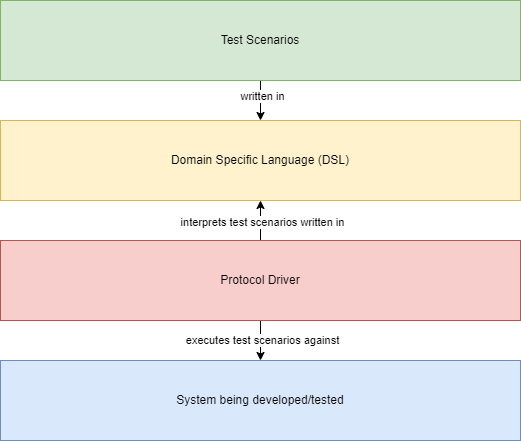
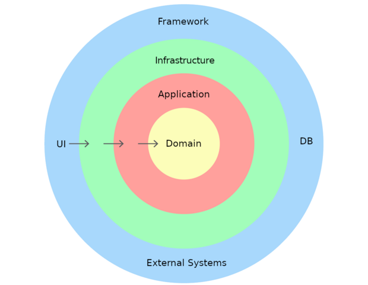

## Introduction

Recently BDD style testing has gained popularity and many teams have started 
writing BDD style tests to make tests more readable to non-technical people.

Unfortunately many teams new to BDD step into some common pitfalls that the BDD
experts warn against. These pitfalls lead to slow tests that cause a lot of harm
and that are not obvious to fix.

This article will attempt to address one of these common pitfalls and how it can
be avoided.

## What is BDD?

Behaviour Driven Development (BDD) is a way of writing software requirements in
the form of executable tests so that a passing test means that the requirement
has been implemented.

Continually running these BDD tests as the code is changed allow us to detect
regressions in our code.

The goal of BDD tests are thus to describe the requirements for the software, 
rather than describing the design of the solution.

## How do BDD tests work?

In programming when we want to decouple two things, one way to do this is with a layer of abstraction. And more
specifically to create an interface for the abstraction with a client calling the interface and a service implementing
the technical concerns to obscure them from the client.

This is exactly what BDD does. The following diagram shows the design pattern for BDD tools like Cucumber etc.



BDD test scenarios are written in a domain specific language (DSL) that looks like a natural language (i.e. English), 
but the language is more constrained in order to keep the protocol driver simple.

The protocol driver interprets the test scenarios written in the DSL and executes the test scenarios against
the system being developed.

It is common to use a Given-When-Then syntax to create the DSL.

## What is the pitfall that teams step into?

Teams often write their BDD tests in a way that describes the solution they have
already designed, rather than the requirements that could be solved using many 
different designs.

This has many drawbacks, but it is worth mentioning a few:

1. The tests are brittle in that a change in the solution design requires the
   tests to be updated to match the latest design. 
2. The tests are more verbose, which makes them harder to write, read and reason about.
3. We end up losing the real requirements and get married to the first solution that we
   designed at a time that we knew the least about the problem we are trying to solve.
4. Changing our designs and refactoring code becomes harder as time progresses because
   we only know what the system does, not why it does it.
5. These tests tend to be slow as we will explain.

## Example User Story

To illustrate the difference between a BDD test scenario that describes the requirement
versus a BDD test scenario that describes the solution design we have chosen a real world
example from the banking sector. We intentionally selected a non-trivial example.

```text
As a prospective home buyer
I want to calculate the maximum mortgage I can afford to repay
so that I can look for a house that I can afford to buy
```

## BDD scenario describing the solution design

The following BDD test scenario is one of many scenarios for the above user story.

This scenario was written in a manner to describe the user interface (UI) design of
the solution.

### Scenario: Simple mortgage calculation

```text
Given I navigate to the mortgages page
and I enter 40,000 into the "Your gross annual income" field
and I enter 30,000 into the "Your partner's gross annual income (Optional)" field
And I click the "Continue calculation button"
And I click the "Together" option for the "Are you buying on your own or together?" question
And I enter "40" into the "What is your age?" field
And I click the "Ok, continue" button
And I enter "38" into the "... and your partner’s?" field
And I click the "Ok, continue" button
And I click the "Yes" option for the "Do you have a Dutch nationality?" question
And I click the "Yes" option for the "Does your partner have a Dutch nationality?" question
And I select "Indefinate contract" for the "What is the source of your income?" question
And I click the "Ok, continue" button
And I enter "40,000" into the "What is your gross annual income?" field
And I click the "Ok, continue" button
And I select "Indefinate contract" for the "What is your partner's source of income?" question
And I click the "Ok, continue" button
And I enter "30,000" into the "What is your partner's gross annual income?" field
And I click the "Ok, continue" button
And I click the "No" option for the "Do either of you have any student loans to pay off?" question
And I click the "No" option for the "Do either or both of you have loans?" question
And I click the "No" option for the "Do either of you pay alimony?" question
And I click the "No" option for the "Do you already own a home?" question
And I enter "10,000" into the "How much money do you intend to contribute yourself?" field
When I click the "Ok, continue" button
Then I see a "Mortgage amount" calculation of €313,959
And I see a "Own funds" calculation of €11,455
And I see a "Gross monthly payment" of €1,429
And I see a "Net monthly payment" of €1,019
And I see "Interest rate 3.61%, annuity mortgage, 10-year fixed-rate period"
```

As can be seen from the scenario above, the user story will have many similar scenarios
for every place where a different option is selected of a different value is entered
that would trigger different branching logic in the code.

## BDD scenario describing the requirement

This scenario was written in a manner to describe the requirements only, without
suggesting a specific solution design.

### Scenario: Simple mortgage calculation

```text
Given my gross annual income is 40,000
And my partner's gross annual income is 30,000
And we want to buy a home together
And my age is 40
And my partner's age is 38
And I have Dutch nationality
And my partner has Dutch nationality
And the source of my income is an Indefinate contract
And the source of my partner's income is an Indefinate contract
And neither of us have student loans to pay off
And neither of us have loans to pay off
And neither of us pay alimony
And neither of us already own a home
And we intend to contribute 10,000 yourself
And the annuity mortgage interest rate on a 10-year fixed-rate period is 3.61%
When we calculate our mortgage amount
Then our calculated mortgage amount is €313,959
And our calculated own funds is €11,455 
And our calculated gross monthly payment is €1,429
And our calculated net monthly payment is €1,019
```

By comparing the 2 examples, we will notice that the second example is shorter and 
less verbose.

The first example describes what the screen looks like in terms of screen labels and button text.
The second example merely describe facts about the rules of the business domain.

## The protocol driver

In order to execute the BDD test scenarios above, the team would need to implement
a protocol driver that interprets the statements in the test scenario and executes
the scenario against the system under development.

The _Given_ statements are used to set up the data required as input for the test.
The single _When_ statement calls the system under test.
The _Then_ statements assert that the output from the system matches the expected results.

## Domain Driven Design

BDD is often associated with Domain Driven Design (DDD), although BDD can be used without DDD.

In order for the team to create the protocol driver for the BDD tests it would be required
to understand the architecture of the system under development.

We have chosen a DDD architecture for our example as it allows the team to make tradeoff
decisions that affect the execution speed of our tests.

We will thus give a basic introduction to DDD.



DDD is a layered architecture that puts the domain entities and business rules at the core
of the architecture. The reason for this is that these tend to be quite stable and change
less frequently than the technical implementation details.

As we move to the outer layers the concerns being addressed become more technical and the
team has more freedom to change the design decisions in these layers.

It is important to note the direction of dependency, which always points from the outside
layers to the inside. Thus, the infrastructure layer may depend on the domain layer, but the
domain layer may not depend on the infrastructure layer. This allows the team to make changes
to the infrastructure layer without the risk of braking something in the domain layer.

The team could for example switch out one database vendor for another without changing the
domain layer.

A common idea in modern software architecture is to delay making technical decisions for
as long as possible. We want to know as much about the problem domain as we can before
making the technical decisions to ensure we make the best decisions.

The layered architecture of DDD allows us to write and test code to implement the domain layer
of a user story and postponing the detailed design of the infrastructure layer of the user story.

## Implementing the protocol driver

Our first BDD scenario that described the UI of the solution forces the team to implement the
protocol driver in a way that it calls the system via the UI.

This requires all the layers to have been developed and to be available when executing the tests.

Infrastructure such as databases and message queues usually run separately from the application code
and are accessed via network calls. Having these available during test execution slows down
test execution because:

- These resources take time to start up and configure. For example, starting up a database process,
  creating a database schema and loading test data into the database takes a long time.
- Network calls are far more expensive than local in process calls.
- For web based applications, the UI runs in a browser that requires startup time and driving a
  web browser via code is slower than just calling a code method/function.

Our second BDD scenario that describes the requirements only allows the team to make a tradeoff
when implementing the protocol driver. The team could write the protocol driver against the
domain layer only, or more likely the application and domain layers and avoiding the outer
layers completely.

These tests do not require expensive startup times and avoid the complexity of introducing technologies
such a Docker containers etc.

These tests are also faster to develop making the team more productive and delivering faster.

## The tradeoff

But we did mention that there is a tradeoff. The tradeoff is that these tests would not cover the
outer layers of our architecture.

What the team could do is write separate tests to test these layers in isolation.
For example, standard unit tests (not BDD) to test the database repository code in isolation
is easy to create.

These tests might still be slow, but can be run less often and only after all the BDD tests 
have passed.

The team could also create some integration tests across all the architectural layers.
These integration tests would still incur all the same expensive startup and complexity costs,
but we would not need to test all the scenarios with these tests which would make them faster.

Another idea would be to only run these integration tests after deployment to an environment.
We would then only test things that ensures all of our infrastructure works together on the
environment but not update the state of the environment. For example testing database reads, 
but not writes. This type of test would avoid the expensive startup and complexity costs
of infrastructure completely and gives the team confidence that the environment is functional
after a deployment. A common term for this is a smoke test.

## Code coverage

Teams and organisations often set code coverage targets that are enforced using tools like SonarQube.
These targets ofter take the form of a percentage of code statements or lines that need to be covered by
tests. For example, a code coverage target of 80% might be enforced.

We would suggest a more sophisticated approach to code coverage. Instead of requiring 80% coverage
across all architecture layers we could say:

- 80% code coverage of our domain and application layers is insufficient, and we really need to aim for
  100%. In our experience this is achievable, but if in doubt aim for 95%.
- 80% code coverage in the outer layers like our infrastructure layer is actually hard to achieve.
  For example, you might have some code to handle a scenario where the database is unavailable.
  This is possible to test with mocking, but not easy when running integrations test that would require
  bringing the database down before running the scenario and bringing it back up after the scenario.

We would also argue that code coverage is more important in the domain layer than the infrastructure
layer.

## Why are slow tests a problem?

It is worth giving some explanation why slow tests are a problem, but this requires some speculation.

If for example a test suite takes 10-30 minutes to run, developers will choose not to run these tests
very often on their local machines as this will destroy their productivity and break their flow.
They would only run the tests for the things they are directly working on and even then not run them
very often as individual tests may still take a minute or 2 to run in order to start up the test
environment.

This means that the full test suite will only be run by our Continuous Integration / Continuous Delivery
(CI/CD) pipelines. If the developer's code change breaks a test that was not run locally it means
the pipeline will fail and the developer will need to make another code change to fix this failing test
and then the CI/CD pipeline will be run again.

Our CI/CD pipelines usually run on expensive cloud infrastructure shared by multiple teams.
Slow tests affect not only the team whose tests are running, but other teams who need to wait
for the resources required by their tests to become available.

## Conclusion

We hope to have demonstrated the problems caused by slow tests and provided practical advice
for making our tests faster.

We also hope that we demonstrated that the ways in which we write our user stories and our
BDD tests are important and not to be underestimates. Our user stories are important
to understand who our users really are and what their goals are. Our BDD scenarios are
important to describe the detailed requirements of our user stories.

User stories and BDD scenarios have value long after the software has been developed and
is running in production, so they are worth writing well.